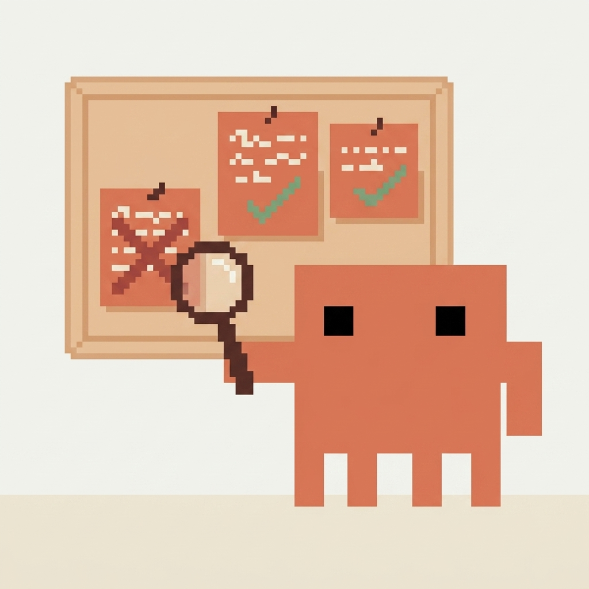

<div align="center">


# 🧠 aprende

### *Convierte cada conversación en conocimiento durable.*

**Un skill comunitario para Claude Code y Codex que ayuda a tu agente a aprender de sus errores — y a no repetirlos.**

[](https://github.com/Hainrixz/aprende-skill/actions/workflows/validate.yml)
[](LICENSE)
[](https://claude.com/claude-code)
[](https://github.com/Hainrixz/aprende-skill)
[](https://www.tododeia.com)
[](CONTRIBUTING.md)

🌎 &nbsp;**Read in [English →](README.md)**

[Instalación](#instalación) · [Uso](#uso) · [Cómo funciona](#las-cuatro-categorías) · [FAQ](#faq) · [Contribuir](CONTRIBUTING.md) · [tododeia.com](https://www.tododeia.com)

</div>

---

## ⚡ Pitch en 30 segundos

Corriges a tu agente. La sesión termina. La semana siguiente, lo
vuelves a corregir sobre exactamente lo mismo. `aprende` lo arregla.
Escribe `/aprende` al final de una sesión — escanea la conversación, saca
a la luz cada corrección que valga la pena, te pregunta cuáles guardar, y
las escribe donde el agente las va a encontrar la próxima vez.
Anti-patrones estilo Reflexion, escritura con confirmación primero,
cross-tool (Claude Code + Codex), bilingüe.

```
Tú:  /aprende

aprende:
  Encontré 3 aprendizajes candidatos en esta conversación.

   1. [project-doc] Usa pnpm, no npm — el usuario dijo "este repo usa pnpm"  (alta)
   2. [lesson]      localStorage falla en el WebView de compra — usa IndexedDB  (alta)
   3. [memory]      El usuario prefiere mensajes de error explícitos en tests  (media)

  >

Tú:  1,2

aprende:
  ✓ project  → ./CLAUDE.md + ./AGENTS.md  (## Commands)
  ✓ lesson   → ~/.claude/projects/.../lesson_webview-localstorage.md
  Capturados 2 aprendizajes. Corre /aprende --review el mes que viene para podar.
```

---

## Por qué existe

<p align="center">
  
</p>

Los agentes de código repiten los mismos errores entre sesiones.
Las correcciones que haces — "no, este repo usa pnpm", "siempre agrega
`using` y `with check` a las políticas RLS" — se evaporan cuando termina
la sesión. Corriges al agente. La semana siguiente, lo corriges otra vez.
Y otra. `aprende` arregla eso. Después de cada sesión, corres `/aprende`.
Saca a la luz lo que valía la pena aprender. Eliges qué conservar. Lo
escribe donde el agente lo va a encontrar la próxima vez.

---

## Las cuatro categorías

| Categoría | Vive en | Cuándo |
|----------|----------|------|
| `memory` | `~/.claude/projects/<slug>/memory/<name>.md` | Hechos durables, preferencias, contexto de proyecto |
| `lesson` (anti-patrón estilo Reflexion) | Misma carpeta, `type: lesson` | Pasó un error. Captura *qué / por qué / cómo evitar / señal de detección* |
| `skill` (stub) | `~/.claude/skills/<slug>/SKILL.md` | Apareció un workflow multi-paso reusable |
| `project-doc` | `./CLAUDE.md` + `./AGENTS.md` (escritura dual) | Comandos de build, convenciones del repo, gotchas para todo agente futuro |

La categoría `lesson` es la que compone valor con el tiempo. Siguiendo el
[paper de Reflexion](https://arxiv.org/abs/2303.11366), cada lección debe
responder cuatro preguntas:

```markdown
**Qué pasó:** ...
**Por qué pasó:** ...
**Cómo evitar:** ...
**Señal de detección:** ...
```

---

## Instalación

### Opción 1 — Plugin (recomendado)

Desde dentro de Claude Code:
```
/plugin marketplace add Hainrixz/aprende-skill
/plugin install aprende@aprende-skill
```

Listo. El skill y sus hooks quedan conectados automáticamente. Los hooks
vienen **activos por defecto** (ver disclosure abajo).

### Opción 2 — Manual

Clona el repo y copia la carpeta del skill:
```bash
git clone https://github.com/Hainrixz/aprende-skill.git
cp -r aprende-skill/skills/aprende ~/.claude/skills/
cp -r aprende-skill/skills/learn ~/.claude/skills/   # alias inglés (opcional)
```

Para activar los hooks (opcional):
```bash
mkdir -p ~/.claude/aprende-hooks
cp aprende-skill/hooks-handlers/*.sh ~/.claude/aprende-hooks/
chmod +x ~/.claude/aprende-hooks/*.sh
```
Luego en Claude Code corre `/aprende-enable-hooks`. Reemplaza
`${CLAUDE_PLUGIN_ROOT}` con `~/.claude/aprende-hooks` en las entradas que
agrega — la instalación manual no setea esa env var.

---

## Uso

| Comando | Efecto |
|---------|--------|
| `/aprende` | Corrida estándar — revisa la conversación, pregunta, escribe tras confirmación. |
| `/learn` | Alias inglés de `/aprende`. |
| `/aprende --review` | Revisa lessons existentes. Marca retiradas o refresca. |
| `/aprende --portable` | Corrida estándar + espeja lessons a `./.aprende/` para compatibilidad con Codex. |
| `/aprende-enable-hooks` | Instala hooks en `~/.claude/settings.json`. |
| `/aprende-disable-hooks` | Los quita. |

### Ejemplo de sesión

```
Tú:  /aprende

aprende:
  Encontré 3 aprendizajes candidatos en esta conversación.

  Responde con: números, "all", "none", o "edit N: <texto>" / "drop low" / "skip N".

   1. [project-doc] Usa pnpm, no npm — el usuario dijo "este repo usa pnpm"  (alta)
   2. [lesson]      localStorage falla en el WebView de compra — usa IndexedDB  (alta)
   3. [memory]      El usuario prefiere mensajes de error explícitos en tests  (media)

  >

Tú:  1,2

aprende:
  ✓ project  → ./CLAUDE.md + ./AGENTS.md  (## Commands)
  ✓ lesson   → ~/.claude/projects/.../lesson_webview-localstorage.md  (+MEMORY.md)

  Capturados 2 aprendizajes. Corre /aprende --review el mes que viene para podar.
```

---

## Hooks (ON por defecto) — disclosure

Cuando instalas vía plugin, dos hooks están activos desde el
inicio:

- **`PostToolUse`** — después de cada llamada Bash / Edit / Write, un
  script (`capture-signal.sh`) inspecciona el resultado. Si ve exit code
  no-cero, un mensaje de error, o el mismo archivo editado 3+ veces,
  appendea una línea a `~/.claude/projects/<slug>/.aprende-signals.md`.
  **Nunca escribe un aprendizaje.** Solo acumula señales para que
  `/aprende` las lea después.
- **`Stop`** — al cerrar la sesión, si hay señales sin revisar y no
  corriste `/aprende`, un script (`stop-suggest.sh`) emite un recordatorio.
  **Tampoco escribe aprendizajes.**

Ambos hooks son bilingües, corren en <50ms, y siempre salen sin error
para no bloquear tu trabajo.

Para desactivar: `/aprende-disable-hooks` (quita las entradas de
`~/.claude/settings.json` — deja un backup).

---

## Cross-tool: Claude Code + Codex

Diseñado para funcionar en ambos ecosistemas:

- **Las escrituras `project-doc` siempre van a ambos** `CLAUDE.md` **y**
  `AGENTS.md`. Mismo contenido. Claude Code lee el primero, Codex el
  segundo.
- **Para lessons y memories**, usa `/aprende --portable` para espejar a
  `./.aprende/lessons/` en la raíz del proyecto, con un
  `./.aprende/index.md` que Codex puede leer vía una línea agregada
  automáticamente a `AGENTS.md`.
- **El skill mismo** es Markdown plano + YAML — cualquier agente que
  entienda la convención [agentskills.io](https://agentskills.io) puede
  invocarlo.

---

## Mapa de almacenamiento

```
~/.claude/
├── projects/
│   └── -Users-tu-ruta-al-proyecto/
│       └── memory/
│           ├── MEMORY.md                    # índice
│           ├── feedback_pnpm-sobre-npm.md   # type: feedback
│           ├── project_supabase-rls.md      # type: project
│           ├── lesson_webview-storage.md    # type: lesson (estilo Reflexion)
│           └── ...
├── skills/
│   ├── aprende/        # el skill (workflow)
│   ├── learn/          # alias inglés
│   └── ...             # cualquier skill que /aprende haya dejado como stub
└── settings.json       # configuración de hooks (tras /aprende-enable-hooks)

<tu-proyecto>/
├── CLAUDE.md           # para Claude Code
├── AGENTS.md           # para Codex (escritura dual, mismo contenido)
└── .aprende/           # solo si usaste --portable
    ├── index.md
    └── lessons/
        └── ...
```

---

## Principios de diseño

<p align="center">
  
</p>

1. **Confirmación primero.** Nada se escribe a disco hasta que digas qué
   guardar. El skill repite esta regla tres veces internamente.
2. **Prefiere falsos negativos.** Una regla equivocada cristalizada es
   peor que repetir una corrección tres veces. Las etiquetas de
   confidence son obligatorias.
3. **Anota overlaps, no dropees.** Cuando un candidato parece duplicado,
   el skill lo marca `[overlaps with: ...]` y te deja decidir.
4. **Retira, no borres.** Las lecciones obsoletas reciben `status:
   retired`, no `rm`. El rastro de auditoría importa.
5. **Reflexion sobre logging.** Las lecciones capturan *por qué* pasó un
   error, no solo *qué*. De ahí viene el [+20% del paper](https://arxiv.org/abs/2303.11366).
6. **Los hooks son consejeros, no autoridades.** Los hooks solo acumulan
   señales y recuerdan. Nunca escriben aprendizajes.
7. **Tope de 15 candidatos por corrida.** Fuerza foco.

---

## FAQ

**P: ¿Mi carpeta de memoria se va a llenar de basura?**
R: Tres defensas: (a) las etiquetas de confidence te hacen filtrar, (b)
el dedup marca overlaps antes de mostrar la lista, (c) `/aprende
--review` te deja podar mensualmente.

**P: ¿Funciona con Codex?**
R: Sí. Las escrituras `project-doc` van a `CLAUDE.md` y `AGENTS.md`.
Para lessons, usa `/aprende --portable`.

**P: ¿El agente puede aprender solo sin que yo corra /aprende?**
R: No. Por diseño. La captura automática es el modo de fallo que
cristaliza falsos positivos. Los hooks te recuerdan correr `/aprende`
pero nunca escriben por su cuenta.

**P: ¿En qué se diferencia de claude-mem / claude-reflect?**
R: `aprende` es intencionalmente más simple: sin SQLite, sin embeddings,
sin MCP. Markdown plano + workflow bilingüe + formato Reflexion para las
lessons. Se enchufa a la convención de memoria existente del usuario en
vez de levantar un sistema paralelo. Si necesitas embeddings o búsqueda
vectorial, usa [claude-mem](https://github.com/thedotmack/claude-mem) —
es la opción más probada en ese terreno.

---

## Contribuir

Issues, PRs, y contribuciones de lessons son bienvenidas. Especialmente:

- **Mejores patrones de señal** en `signal-patterns.md` (cualquier idioma).
- **Lessons reales** de tus sesiones — ejemplos anonimizados que muestran
  el formato de cuatro secciones funcionando bien.
- **Bug reports** — sobre todo, falsos positivos que pasaron la
  confirmación.

Ver la guía completa en [CONTRIBUTING.md](CONTRIBUTING.md).

---

## Créditos

Construido sobre patrones de:

- [Reflexion (Shinn et al., 2023)](https://arxiv.org/abs/2303.11366) —
  el patrón de "post-mortem lingüístico".
- [Hermes Agent (Nous Research)](https://github.com/NousResearch/hermes-agent) —
  la idea de "sintetizar skills desde workflows recurrentes".
- [claude-reflect](https://github.com/BayramAnnakov/claude-reflect) —
  scoring de confidence contra falsos positivos.
- [claude-mem](https://github.com/thedotmack/claude-mem) —
  patrón de captura vía hooks.
- El sistema de memoria de Claude Code — `aprende` extiende la
  convención de memoria por-proyecto existente en vez de reemplazarla.

Mascota y arte del hero generados con [Higgsfield](https://higgsfield.ai)
(Nano Banana Pro) a partir de una referencia pixel-art diseñada para el
proyecto.

---

## Licencia

MIT — ver [LICENSE](LICENSE).

---

<div align="center">

### Hecho con disciplina contra los falsos positivos.

**Construido por [tododeia](https://www.tododeia.com) · Mantenido por [@Hainrixz](https://github.com/Hainrixz)**

Si `aprende` te salvó de repetir un error, [⭐ dale una estrella al repo](https://github.com/Hainrixz/aprende-skill) y compártelo con alguien cuyo agente sigue haciendo lo mismo mal.

🌎 &nbsp;**[Read in English →](README.md)**

[**www.tododeia.com**](https://www.tododeia.com)

</div>
